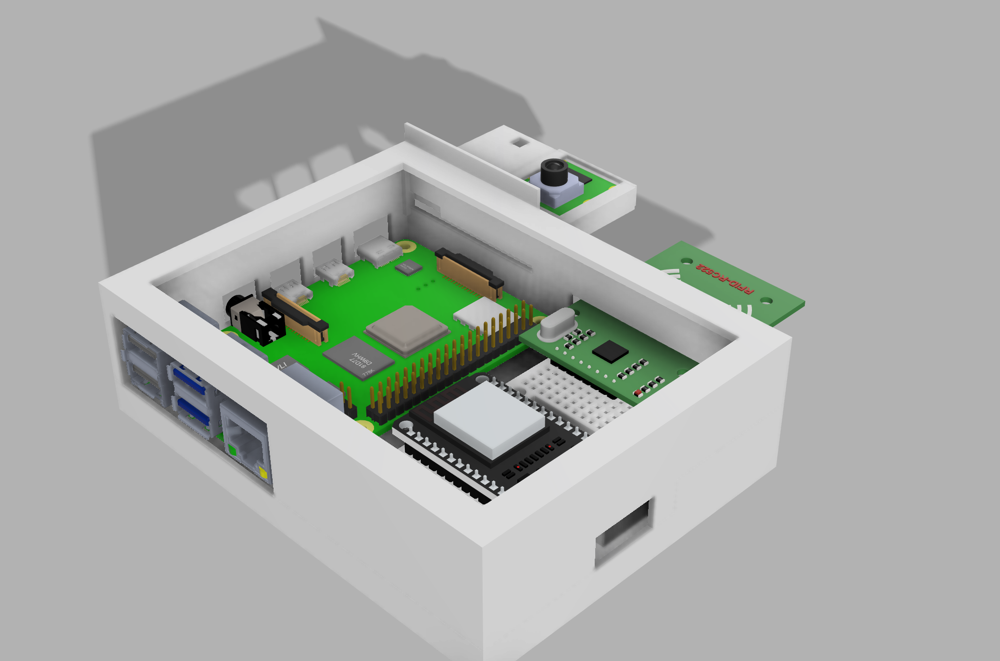

## I. 아이템 설명

세콤네컷은 제가 개발한 것은 아니라서 정확하게는 모르지만 이해한 내용을 최대한 작성하였습니다…

### 1. 아이템 개요

세콤네컷은 RFID 태그를 이용하여 사진 촬영을 자동화하는 시스템이다. 사용자가 카드를 인식시키면 LED가 깜빡이며 사진이 찍힌다. 이후 영수증 프린터를 통해 출력되며, QR 코드를 통해 다운로드할 수 있다.

### 2. 사용 방법

1. RFID 태그(카드)를 인식시키면 LED에 불이 들어온다.
2. LED가 세 번 깜빡이고, 카메라가 사진을 촬영한다.
3. 촬영된 사진이 영수증 프린터를 통해 출력된다.
4. 제공된 QR 코드를 스캔하면 해당 사진을 하루 동안 다운로드할 수 있다. (현재 와이파이를 연결하지 않아서 이 기능은 활성화되어있지 않음)

### 3. 하드웨어 구성 및 작동 원리

**구성 요소:**

- **ESP32**: RFID 리더와 통신하며, 신호를 Raspberry Pi로 전달
- **RFID 리더**: 태그를 인식하여 촬영 또는 재출력 여부 결정
- **Raspberry Pi 4B**: 사진 촬영 및 데이터 관리
- **파이 카메라**: 촬영 장치
- **LED**: 촬영 시점 표시
- **영수증 프린터**: 촬영된 사진 출력

**작동 원리:**

1. 사용자가 RFID 리더에 RFID 태그를 인식시키면 촬영 트리거가 발동된다.
    - ESP32는 RFID 태그를 감지하고, 촬영 및 재출력 신호를 Raspberry Pi에 전달하는 역할을 한다.
        - RFID 태그의 UID를 판별하여 촬영 또는 재출력 여부를 결정.
        - GPIO 핀을 통해 Raspberry Pi에 신호 전달.
        - RFID 태그가 인식되지 않으면 오류 메시지를 출력.
2. 라즈베리파이가 LED를 점멸시키고, 사진을 촬영한다.
    - LED가 세 번 천천히 깜빡인다.
    - 사진 촬영 순간 LED가 빠르게 깜빡인다 (플래시 역할).
3. 촬영된 사진이 영수증 프린터로 전달된다.
4. 영수증 프린터가 사진을 출력한다.
    - RFID 리더가 2개가 있으며, 하나는 직전에 찍은 사진을 재출력하는 기능을 담당한다 (여러 사람에게 동일한 사진을 제공 가능).
    - 다른 하나는 새로운 사진을 촬영하는 트리거 역할을 한다. 이는 카드 형식으로 코팅되어 홍보 자료로 사용된다.

### 4. 네트워크 연결 및 서버 연동

- 핫스팟 설정을 통해 특정 Wi-Fi 네트워크에 연결하도록 설정 가능.
- 라즈베리파이가 부팅될 때 인터넷에 연결되면 서버와 동기화되며 QR 코드로 사진을 다운로드할 수 있는 기능을 제공한다.

## II. 케이스를 새로 모델링

케이스는 새로 모델링 하였습니다. 케이스를 모델링하여 3D 프린터로 출력함 이를 홍보 과정에서 사용하면 좋을 듯. 케이스 모습은 다음과 같음

아직 가조립만 해둔 상태 뚜껑이 그냥 열립니다. 카메라 모듈도 강하게 고정하지 않아서 떨어질 수 있읍니다. 동박 전에 완전 조립을 해야합니다다.

